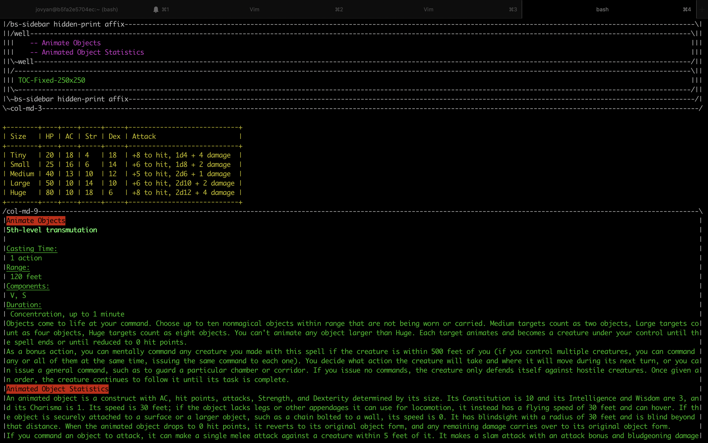
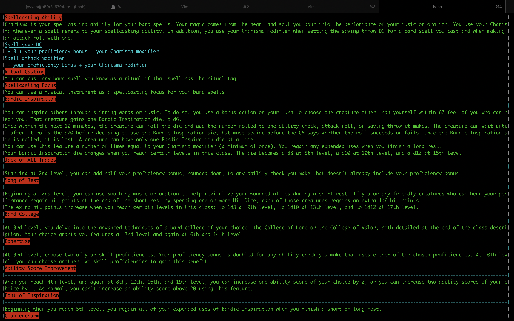
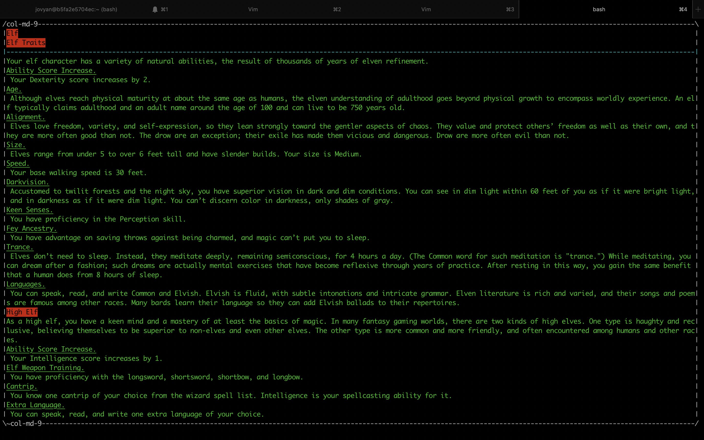

# itbrowz

## For all your in-terminal browsing needs

This project was initially designed to just render a few pages of a website for
D&D enthusiasts (https://5thsrd.org/) right in the terminal.

Since then, it has spiraled out of control into a fledgling in-terminal web browser.

#### Installation

- Ensure you have python3.8, iTerm2, and git installed on your local machine
- If you do not already have a directory for all your git repositories, run `cd ~; mkdir git_repos; cd get_repos;`
- Clone this repository with `git clone https://github.com/AlexisGoodfellow/itbrowz.git`
- Run `cd itbrowz; pip3 install -r requirements.txt; ln ~/git_repos/itbrowz/itbrowz.py /usr/local/bin/itbrowz; ln ~/git_repos/itbrowz/imgcat /usr/local/bin/imgcat`

#### Using itbrowz

You can only use `itbrowz` inside of iTerm2 on MacOS.
`itbrowz` does not work in the native Mac Terminal utility.

Basic usage is `itbrowz --url <desired_website_url>`.

Because `itbrowz` has not yet implemented rendering for all possible HTML elements,
you might need to narrow its scope a bit. To do this, you can supply an extra argument
to filter down to the element it starts rendering from. This usage looks like

`itbrowz --url <desired_website_url> --div <div_id_or_class>`

You can determine the value for `<div_id_or_class>` from your primary graphical
browser's Developer Tools.

In keeping with its roots, `itbrowz` still provides convenience wrappers for
accessing D&D spells, classes, and races. To do this, simply do one of:

- `itbrowz --spell <spell_name>`
- `itbrowz --class <class_name>`
- `itbrowz --race <race_name>`

If you ever need to reference any of these options, you can consult the
documentation with `itbrowz --help`.

#### Sample Output

- Excerpt of `itbrowz --spell animate-objects`

- Excerpt of `itbrowz --class bard`

- Excerpt of `itbrowz --race elf`

#### Missing features

`itbrowz` does not support JavaScript or custom CSS styling. This is intentional,
as supporting such features is a massive undertaking and the current priority is
to continue implementing rendering for additional HTML tags.

#### Contributing

Open an issue on GitHub if you experience any difficulty using `itbrowz` which
clearly describes what the problem is and what steps you've taken to solve it so far.
